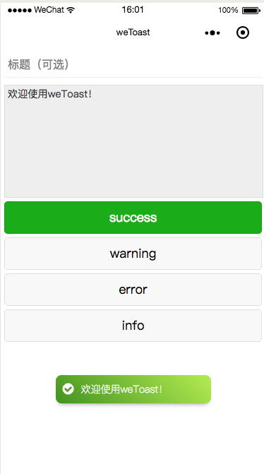
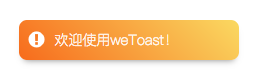
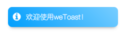
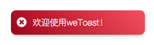

# weToast
> 为微信小程序设计的toast消息通知模块



## 安装

### 下载代码

存储到微信小程序的`libs`目录，如：
```sh
$ cd weapp-project
$ mkdir libs && cd libs
$ git clone https://github.com/safe-dog/weToast.git
```

### 引用代码

#### 引用wxss
> 样式文件`weToast.wxss`

我们在全局文件`app.wxss`中加入如下代码即可：
``` css
@import "libs/weToast/weToast.wxss";
```

#### 引用wxml
> 模版文件`weToast.wxml`

在需要使用的页面中的`wxml`文件的任意位置，插入如下代码即可：
``` xml
<include src="../../libs/weToast/weToast.wxml" />
```

#### 引用js
> 模块调用文件`weToast.js`

这个需要在`Page`页面中的`onLoad`函数进行调用并初始化，初始化传递本身对象参数即可（`this`）：
``` js
// pages/toast/index.js
const weToast = require('../../libs/weToast/weToast.js');
var toast;

Page({

  /**
   * 页面的初始数据
   */
  data: {
  },

  /**
   * 生命周期函数--监听页面加载
   */
  onLoad: function (options) {
    toast = new weToast(this);
    toast.success('欢迎使用weToast！') ;
  },
  
  ...
```

## 使用

### `.success(content, title = '')`
> 成功消息，青绿色


### `.warning(content, title = '')`
> 警告消息，橙黄色



### `.info(content, title = '')`
> 提示信息，青蓝色



### `.error(content, title = '')`
> 错误信息，姨妈红



## 其他

### 设置卡片停留时间
> 单位：毫秒

``` js
toast.setDelay(2000)
```